# درخت دسته‌بندی نهایی ۱۸۴ مقاله عمومی Qpedia

این سند مسیر یکتای هر مقاله را نشان می‌دهد: **دسته مادر ← دسته اصلی ← زیردسته ← مقاله**.

## نمای گرافیکی درخت

```mermaid
graph TD
  M1["دانش بنیادی کوانتوم<br/>quantum-foundations"]
  M1 --> M1C1["مبانی فیزیک کوانتومی<br/>quantum-fundamentals"]
  M1C1 --> M1C1S1["حالت، تابع موج و مفاهیم پایه<br/>quantum-state-wave-function-basics<br/>21 مقاله"]
  M1C1 --> M1C1S2["برهم‌نهی، درهم‌تنیدگی و همدوسی<br/>superposition-entanglement-coherence<br/>8 مقاله"]
  M1C1 --> M1C1S3["اندازه‌گیری، احتمال و عدم‌قطعیت<br/>measurement-probability-uncertainty<br/>6 مقاله"]
  M1C1 --> M1C1S4["اثرها، انرژی و پدیده‌های کوانتومی<br/>quantum-effects-energy-phenomena<br/>9 مقاله"]
  M1 --> M1C2["تفسیرها، فلسفه و مرزهای واقعیت<br/>quantum-interpretations-philosophy"]
  M1C2 --> M1C2S1["تفسیر، واقعیت و مسئله ناظر<br/>quantum-interpretation-reality-observer<br/>7 مقاله"]
  M1C2 --> M1C2S2["چندجهانی و فرضیه‌های واقعیت<br/>multiverse-reality-hypotheses<br/>4 مقاله"]
  M1C2 --> M1C2S3["زمان، اختیار و آگاهی<br/>time-free-will-consciousness<br/>3 مقاله"]
  M1 --> M1C3["ذرات، میدان‌ها و فیزیک هسته‌ای<br/>particles-fields-nuclear"]
  M1C3 --> M1C3S1["ذرات، میدان‌ها، هسته و نیروها<br/>particles-fields-nuclei-forces<br/>11 مقاله"]
  M1C3 --> M1C3S2["پادماده، ماده تاریک و ذرات فرضی<br/>antimatter-dark-matter-hypothetical-particles<br/>3 مقاله"]
  M2["جهان کوانتومی و ساختار ماده<br/>quantum-world-matter"]
  M2 --> M2C1["اپتیک کوانتومی و فوتونیک<br/>quantum-optics-photonics"]
  M2C1 --> M2C1S1["نور، لیزر و فوتونیک کوانتومی<br/>quantum-light-lasers-photonics<br/>3 مقاله"]
  M2C1 --> M2C1S2["تصویربرداری، میکروسکوپی و لیتوگرافی<br/>quantum-imaging-microscopy-lithography<br/>3 مقاله"]
  M2 --> M2C2["ماده چگال و مواد کوانتومی<br/>condensed-matter-quantum-materials"]
  M2C2 --> M2C2S1["ابررسانایی و مواد کوانتومی<br/>superconductivity-quantum-materials<br/>5 مقاله"]
  M2C2 --> M2C2S2["ابرشارگی، چگالش و گازهای کوانتومی<br/>superfluidity-condensates-quantum-gases<br/>3 مقاله"]
  M2 --> M2C3["کیهان، گرانش و ترمودینامیک کوانتومی<br/>quantum-cosmology-gravity-thermodynamics"]
  M2C3 --> M2C3S1["گرانش، فضا–زمان و سیاه‌چاله‌ها<br/>gravity-spacetime-black-holes<br/>6 مقاله"]
  M2C3 --> M2C3S2["کیهان‌شناسی و جهان آغازین<br/>quantum-cosmology-early-universe<br/>6 مقاله"]
  M3["اطلاعات و فناوری کوانتومی<br/>quantum-information-technology"]
  M3 --> M3C1["رایانش کوانتومی<br/>quantum-computing"]
  M3C1 --> M3C1S1["رایانش، الگوریتم‌ها و محدودیت‌های کوانتومی<br/>quantum-computing-algorithms-limitations<br/>5 مقاله"]
  M3C1 --> M3C1S2["سخت‌افزار، نرم‌افزار و محدودیت‌ها<br/>quantum-computing-systems-limitations<br/>13 مقاله"]
  M3 --> M3C2["ارتباطات، شبکه و امنیت کوانتومی<br/>quantum-communication-security"]
  M3C2 --> M3C2S1["ارتباط، تله‌پورت و شبکه کوانتومی<br/>quantum-communication-teleportation-networks<br/>5 مقاله"]
  M3C2 --> M3C2S2["رمزنگاری و امنیت در عصر کوانتوم<br/>quantum-cryptography-security<br/>4 مقاله"]
  M3 --> M3C3["هوش مصنوعی و یادگیری ماشین کوانتومی<br/>quantum-ai-machine-learning"]
  M3C3 --> M3C3S1["هوش مصنوعی کوانتومی؛ مبانی و محدودیت‌ها<br/>quantum-ai-foundations-limitations<br/>3 مقاله"]
  M4["کوانتوم در علم، فناوری و جامعه<br/>quantum-science-technology-society"]
  M4 --> M4C1["اندازه‌گیری، حسگرها و فناوری‌های کوانتومی<br/>quantum-sensing-technologies"]
  M4C1 --> M4C1S1["الکترونیک و فناوری‌های روزمره<br/>quantum-electronics-everyday-technology<br/>6 مقاله"]
  M4C1 --> M4C1S2["سنجش، زمان‌سنجی و ناوبری<br/>quantum-sensing-time-navigation<br/>5 مقاله"]
  M4 --> M4C2["تاریخ، آموزش و جامعه کوانتومی<br/>quantum-history-education-society"]
  M4C2 --> M4C2S1["سواد علمی و تشخیص شبه‌علم<br/>scientific-literacy-pseudoscience<br/>6 مقاله"]
  M4C2 --> M4C2S2["آزمایش‌ها و رویدادهای تاریخی<br/>quantum-historical-experiments-events<br/>10 مقاله"]
  M4C2 --> M4C2S3["جایزه‌ها و دستاوردهای علمی<br/>quantum-awards-scientific-achievements<br/>4 مقاله"]
  M4C2 --> M4C2S4["آموزش، منابع و مسیر یادگیری<br/>quantum-learning-resources<br/>7 مقاله"]
  M4C2 --> M4C2S5["فرهنگ، رسانه، صنعت و آینده کوانتوم<br/>quantum-culture-media-industry-future<br/>6 مقاله"]
  M4 --> M4C3["شیمی، زیست‌شناسی و پزشکی کوانتومی<br/>quantum-chemistry-biology-medicine"]
  M4C3 --> M4C3S1["شیمی، زیست‌شناسی، مغز و کوانتوم<br/>quantum-chemistry-biology-brain<br/>6 مقاله"]
  M4C3 --> M4C3S2["پزشکی و ارزیابی ادعاهای درمانی<br/>quantum-medicine-claims<br/>6 مقاله"]
```

## فهرست مقاله‌ها در شاخه‌ها

## دانش بنیادی کوانتوم — `quantum-foundations` (72 مقاله)

### مبانی فیزیک کوانتومی — `quantum-fundamentals` (44 مقاله)

#### حالت، تابع موج و مفاهیم پایه — `quantum-state-wave-function-basics` (21 مقاله)

| شماره جدید | شماره WXR | عنوان فارسی | اسلاگ مقاله |
|---:|---:|---|---|
| 1 | 1 | کوانتوم یعنی چه؟ | `what-is-quantum` |
| 3 | 3 | دوگانگی موج و ذره | `wave-particle-duality` |
| 4 | 4 | تابع موج چیست؟ کامل‌ترین نقشهٔ یک ذره — ولی خودش واقعیت نیست | `wave-function` |
| 6 | 6 | اسپین؛ چرخشی که چرخش نیست | `quantum-spin` |
| 7 | 7 | ترازهای انرژی و کوانتش | `energy-levels` |
| 9 | 9 | ثابت پلانک چیست؟ مقیاس بنیادی کوانتومی، نه کوچک‌ترین واحد جهان | `planck-constant` |
| 19 | 19 | فاجعهٔ فرابنفش | `ultraviolet-catastrophe` |
| 20 | 20 | مدل اتمی بور | `bohr-atomic-model` |
| 38 | 41 | صفر مطلق چیست؟ | `absolute-zero` |
| 43 | 47 | چرا کوانتوم را در زندگی روزمره حس نمی کنیم؟ | `quantum-classical-boundary` |
| 94 | 113 | ماکس بورن و تفسیر احتمالاتی؛ مربع تابع موج چه می گوید؟ | `born-probability` |
| 100 | 126 | اصل طرد پاولی دقیقاً چه می‌گوید؟ به زبان ساده | `pauli-exclusion-principle` |
| 104 | 130 | آیا فیزیک کلاسیک اشتباه بود؟ نه، محدود بود | `is-classical-physics-wrong` |
| 109 | 135 | اصل عدم قطعیت هایزنبرگ به زبان ساده | `heisenberg-uncertainty-principle` |
| 111 | 138 | تفاوت جبرگرایی کلاسیک و احتمال کوانتومی | `determinism-vs-probability` |
| 112 | 139 | نیلز بور و اصل تکمیل؛ چرا یک چیز هم موج است هم ذره؟ | `bohr-complementarity` |
| 113 | 141 | تفاوت فیزیک کوانتوم و مکانیک کوانتومی چیست؟ | `quantum-physics-vs-quantum-mechanics` |
| 117 | 145 | عدد کوانتومی چیست؟ | `quantum-number` |
| 119 | 147 | اصل مکملیت چیست؟ | `complementarity-principle` |
| 172 | 292 | حالت کوانتومی چیست؟ چرا «الکترون کجاست؟» پرسش اشتباه است؟ | `quantum-state` |
| 176 | 301 | اسپین هسته‌ای چیست؟ | `nuclear-spin` |

#### برهم‌نهی، درهم‌تنیدگی و همدوسی — `superposition-entanglement-coherence` (8 مقاله)

| شماره جدید | شماره WXR | عنوان فارسی | اسلاگ مقاله |
|---:|---:|---|---|
| 2 | 2 | برهم‌نهی کوانتومی؛ چرا سکهٔ چرخان، الکترون نیست؟ | `quantum-superposition` |
| 8 | 8 | واهمدوسی (Decoherence)؛ چرا گربه‌ای را نمی‌بینیم که هم‌زمان زنده و مرده باشد؟ | `decoherence` |
| 11 | 11 | درهم‌تنیدگی کوانتومی؛ «اثر شبح‌وار» که واقعی است، اما پیام نمی‌فرستد | `quantum-entanglement-explained` |
| 21 | 21 | نامساوی بل | `bell-inequality` |
| 110 | 137 | برهم نهی یعنی چه، و چرا اشیای بزرگ برهم نهی نمی شوند | `why-large-objects-dont-superpose` |
| 164 | 281 | آیا درهم تنیدگی یعنی اطلاعات سریع تر از نور منتقل می شود؟ | `entanglement-myths` |
| 167 | 285 | درهم‌تنیدگی در کامپیوترهای کوانتومی امروزی | `entanglement-quantum-computers` |
| 177 | 302 | همدوسی چیست؟ | `coherence` |

#### اندازه‌گیری، احتمال و عدم‌قطعیت — `measurement-probability-uncertainty` (6 مقاله)

| شماره جدید | شماره WXR | عنوان فارسی | اسلاگ مقاله |
|---:|---:|---|---|
| 5 | 5 | اندازه‌گیری و فروپاشی در کوانتوم؛ بزرگ‌ترین درزِ مکانیک کوانتومی | `quantum-measurement` |
| 14 | 14 | اثر زنون کوانتومی | `quantum-zeno-effect` |
| 74 | 80 | مولد عدد تصادفی کوانتومی؛ آیا تصادف بنیادی قابل استفاده است؟ | `quantum-random-number-generator` |
| 114 | 142 | تمثیل تاس در مقابل تمثیل سکه: کدام برای عدم قطعیت بهتر است؟ | `coin-vs-dice-quantum-uncertainty` |
| 118 | 146 | ناظر در کوانتوم چیست؟ | `observer` |
| 157 | 220 | احتمال کوانتومی؛ چرا جمع دامنه‌ها با جمع احتمال‌ها فرق دارد؟ | `quantum-probability` |

#### اثرها، انرژی و پدیده‌های کوانتومی — `quantum-effects-energy-phenomena` (9 مقاله)

| شماره جدید | شماره WXR | عنوان فارسی | اسلاگ مقاله |
|---:|---:|---|---|
| 10 | 10 | آزمایش دو شکاف؛ معروف‌ترین آزمایش فیزیک، که هنوز هم درک کاملش سخت است | `double-slit-experiment` |
| 12 | 12 | تونل‌زنی کوانتومی؛ پدیده‌ای که بدونش خورشید نمی‌تابید | `quantum-tunneling` |
| 15 | 15 | نوسانات خلأ | `vacuum-fluctuations` |
| 16 | 16 | اثر کازیمیر | `casimir-effect` |
| 39 | 42 | واپاشی آلفا چیست؟ | `alpha-decay` |
| 58 | 63 | ترمودینامیک کوانتومی؛ موتوری به اندازهٔ یک اتم | `quantum-thermodynamics` |
| 91 | 104 | اثر آهارونوف-بوهم؛ فاز بدون میدان محلی | `aharonov-bohm-effect` |
| 122 | 150 | ذرات مجازی چیستند؟ | `virtual-particles` |
| 182 | 307 | قضیهٔ عدم‌کپی چیست؟ | `no-cloning-theorem` |

### تفسیرها، فلسفه و مرزهای واقعیت — `quantum-interpretations-philosophy` (14 مقاله)

#### تفسیر، واقعیت و مسئله ناظر — `quantum-interpretation-reality-observer` (7 مقاله)

| شماره جدید | شماره WXR | عنوان فارسی | اسلاگ مقاله |
|---:|---:|---|---|
| 22 | 22 | تفسیر کپنهاگی | `copenhagen-interpretation` |
| 44 | 48 | داروینیسم کوانتومی؛ چرا همه یک واقعیت می بینیم؟ | `quantum-darwinism` |
| 81 | 87 | پارادوکس دوست ویگنر؛ آیا واقعیت برای همه یکی است؟ | `wigner-friend` |
| 97 | 121 | گربه شرودینگر؛ آزمایش فکری درباره اندازه‌گیری کوانتومی | `schrodinger-cat` |
| 105 | 131 | آیا فیزیک دانان بر سر معنای اندازه گیری توافق دارند؟ | `quantum-interpretation-debate` |
| 107 | 133 | آیا کوانتوم یعنی چندجهانی واقعی است؟ | `is-many-worlds-real` |
| 130 | 158 | تفسیر دوبروی-بوهم چیست؟ | `pilot-wave` |

#### چندجهانی و فرضیه‌های واقعیت — `multiverse-reality-hypotheses` (4 مقاله)

| شماره جدید | شماره WXR | عنوان فارسی | اسلاگ مقاله |
|---:|---:|---|---|
| 23 | 23 | تفسیر جهان‌های موازی | `many-worlds-interpretation` |
| 35 | 35 | آیا کوانتوم ثابت می کند خدا وجود دارد یا ندارد؟ | `does-quantum-prove-god` |
| 40 | 44 | اصل هولوگرافیک؛ آیا جهان ما یک هولوگرام است؟ | `holographic-principle` |
| 83 | 89 | آیا جهان یک شبیه سازی است؟ نقد سه استدلال کوانتومی | `simulation-hypothesis-quantum` |

#### زمان، اختیار و آگاهی — `time-free-will-consciousness` (3 مقاله)

| شماره جدید | شماره WXR | عنوان فارسی | اسلاگ مقاله |
|---:|---:|---|---|
| 45 | 49 | کوانتوم و ارادهٔ آزاد؛ آیا آینده از قبل نوشته شده؟ | `quantum-free-will` |
| 63 | 69 | آیا سفر در زمان با فیزیک کوانتوم ممکن است؟ | `quantum-time-travel` |
| 82 | 88 | جاودانگی کوانتومی؛ کجای این استدلال می لنگد؟ | `quantum-immortality` |

### ذرات، میدان‌ها و فیزیک هسته‌ای — `particles-fields-nuclear` (14 مقاله)

#### ذرات، میدان‌ها، هسته و نیروها — `particles-fields-nuclei-forces` (11 مقاله)

| شماره جدید | شماره WXR | عنوان فارسی | اسلاگ مقاله |
|---:|---:|---|---|
| 84 | 90 | گلوئون و بوزون W و Z؛ چسب هسته و واپاشی | `gluon-w-z-bosons` |
| 85 | 91 | میون و تاو؛ پسرعموهای سنگین الکترون | `muon-and-tau` |
| 98 | 124 | فوتون دقیقا چیست ؟ | `photon` |
| 99 | 125 | الکترون چیست؟ ویژگی‌ها، نقش در اتم و برق | `electron` |
| 120 | 148 | نوترینو چیست؟ | `neutrino` |
| 121 | 149 | مدل استاندارد چیست؟ | `standard-model` |
| 132 | 160 | پروتون از چه ساخته شده؟ کوارک کافی نیست | `proton-neutron-quark-structure` |
| 159 | 224 | الکترودینامیک کوانتومی؛ نظریه‌ای که نور و بار را با دقت بی‌سابقه پیوند می‌دهد | `quantum-electrodynamics` |
| 173 | 293 | کوارک چیست؟ | `quark` |
| 174 | 294 | بوزون هیگز چیست؟ | `higgs-boson` |
| 181 | 306 | همجوشی ستارگان چگونه ممکن است؟ | `stellar-fusion` |

#### پادماده، ماده تاریک و ذرات فرضی — `antimatter-dark-matter-hypothetical-particles` (3 مقاله)

| شماره جدید | شماره WXR | عنوان فارسی | اسلاگ مقاله |
|---:|---:|---|---|
| 141 | 188 | اکسیون؛ ذره‌ای فرضی میان مسئلهٔ CP قوی و مادهٔ تاریک | `axion` |
| 142 | 189 | ویمپ؛ نامزد مشهور مادهٔ تاریک که هنوز پنهان مانده است | `wimp` |
| 175 | 295 | پادماده چیست؟ | `antimatter` |

## جهان کوانتومی و ساختار ماده — `quantum-world-matter` (26 مقاله)

### اپتیک کوانتومی و فوتونیک — `quantum-optics-photonics` (6 مقاله)

#### نور، لیزر و فوتونیک کوانتومی — `quantum-light-lasers-photonics` (3 مقاله)

| شماره جدید | شماره WXR | عنوان فارسی | اسلاگ مقاله |
|---:|---:|---|---|
| 13 | 13 | اثر فوتوالکتریک | `photoelectric-effect` |
| 25 | 25 | لیزر چطور کار می‌کند؟ | `how-lasers-work` |
| 137 | 171 | نور کند؛ کنترل سرعت گروهی بدون کندشدن ثابت بنیادی نور | `slow-light` |

#### تصویربرداری، میکروسکوپی و لیتوگرافی — `quantum-imaging-microscopy-lithography` (3 مقاله)

| شماره جدید | شماره WXR | عنوان فارسی | اسلاگ مقاله |
|---:|---:|---|---|
| 135 | 164 | روشن‌سازی کوانتومی؛ تشخیص هدف در محیط پرنویز | `quantum-illumination` |
| 138 | 172 | لیتوگرافی کوانتومی؛ الگودهی زیر حد رایلی و هزینهٔ واقعی آن | `quantum-lithography` |
| 161 | 252 | میکروسکوپ کوانتومی؛ دیدن نمونه با فوتون کمتر | `quantum-microscopy` |

### ماده چگال و مواد کوانتومی — `condensed-matter-quantum-materials` (8 مقاله)

#### ابررسانایی و مواد کوانتومی — `superconductivity-quantum-materials` (5 مقاله)

| شماره جدید | شماره WXR | عنوان فارسی | اسلاگ مقاله |
|---:|---:|---|---|
| 17 | 17 | ابررسانایی | `superconductivity` |
| 57 | 62 | مایع اسپینی کوانتومی؛ ماده ای که هرگز آرام نمی گیرد | `quantum-spin-liquid` |
| 75 | 81 | ابررسانای دمای اتاق؛ درس LK-99 دربارهٔ هیجان علمی | `room-temperature-superconductor` |
| 79 | 85 | پیوند جوزفسون؛ قلب تپندهٔ کامپیوتر کوانتومی | `josephson-junction` |
| 160 | 238 | عایق توپولوژیک؛ درون عایق، روی سطح رسانا | `topological-insulator` |

#### ابرشارگی، چگالش و گازهای کوانتومی — `superfluidity-condensates-quantum-gases` (3 مقاله)

| شماره جدید | شماره WXR | عنوان فارسی | اسلاگ مقاله |
|---:|---:|---|---|
| 18 | 18 | ابرشارگی؛ مایعی که از لیوان بالا می‌رود | `superfluidity` |
| 49 | 53 | کریستال زمان چیست؟ ماده ای که در زمان تکرار می شود | `time-crystal` |
| 180 | 305 | چگالش بوز-اینشتین چیست؟ | `bose-einstein-condensate` |

### کیهان، گرانش و ترمودینامیک کوانتومی — `quantum-cosmology-gravity-thermodynamics` (12 مقاله)

#### گرانش، فضا–زمان و سیاه‌چاله‌ها — `gravity-spacetime-black-holes` (6 مقاله)

| شماره جدید | شماره WXR | عنوان فارسی | اسلاگ مقاله |
|---:|---:|---|---|
| 46 | 50 | گرانش کوانتومی چیست؟ بزرگ ترین چالش فیزیک | `quantum-gravity` |
| 48 | 52 | نظریهٔ ریسمان و کوانتوم؛ جهان از جنس نت است؟ | `string-theory-quantum` |
| 59 | 64 | پارادوکس اطلاعات سیاه چاله؛ معمای هاوکینگ | `black-hole-information-paradox` |
| 146 | 193 | کرم‌چاله؛ میان‌بُر فضا–زمان میان ریاضیات و واقعیت | `wormhole` |
| 153 | 201 | تکینگی کوانتومی؛ مرز شکست نظریه یا جهش فرضی فناوری؟ | `quantum-singularity` |
| 158 | 221 | تابش شتاب و اثر اونرو؛ آیا ناظر شتاب‌دار خلأ را گرم می‌بیند؟ | `acceleration-radiation` |

#### کیهان‌شناسی و جهان آغازین — `quantum-cosmology-early-universe` (6 مقاله)

| شماره جدید | شماره WXR | عنوان فارسی | اسلاگ مقاله |
|---:|---:|---|---|
| 53 | 58 | افت وخیز کوانتومی؛ چطور کهکشان ها متولد شدند؟ | `quantum-fluctuations-cosmos` |
| 143 | 190 | انرژی تاریک و جهان کوانتومی؛ بحران کوچک‌ترین چگالی بزرگ فیزیک | `dark-energy-quantum` |
| 144 | 191 | تورم کیهانی؛ جهش آغازین فضا و بذر ساختارهای جهان | `cosmic-inflation` |
| 145 | 192 | تابش زمینهٔ کیهانی؛ قدیمی‌ترین نوری که می‌توانیم ببینیم | `cosmic-microwave-background` |
| 147 | 194 | کیهان‌شناسی کوانتومی؛ وقتی خود جهان موضوع نظریه کوانتومی می‌شود | `quantum-cosmology` |
| 148 | 195 | جهش کوانتومی کیهان؛ آیا پیش از مهبانگ مرحله‌ای دیگر وجود داشت؟ | `quantum-bounce` |

## اطلاعات و فناوری کوانتومی — `quantum-information-technology` (30 مقاله)

### رایانش کوانتومی — `quantum-computing` (18 مقاله)

#### رایانش، الگوریتم‌ها و محدودیت‌های کوانتومی — `quantum-computing-algorithms-limitations` (5 مقاله)

| شماره جدید | شماره WXR | عنوان فارسی | اسلاگ مقاله |
|---:|---:|---|---|
| 24 | 24 | کیوبیت چیست؟ چرا «بیت کوانتومی» یک بیت بهتر نیست؟ | `qubit` |
| 90 | 102 | محاسبه با اندازه گیری؛ کامپیوتر یک طرفه | `measurement-based-quantum-computing` |
| 129 | 157 | الگوریتم شور چیست؟ | `shor-algorithm` |
| 178 | 303 | الگوریتم گروور چیست؟ | `grover-algorithm` |
| 183 | 308 | گیت کوانتومی چیست؟ | `quantum-gate` |

#### سخت‌افزار، نرم‌افزار و محدودیت‌ها — `quantum-computing-systems-limitations` (13 مقاله)

| شماره جدید | شماره WXR | عنوان فارسی | اسلاگ مقاله |
|---:|---:|---|---|
| 51 | 55 | پردازندهٔ IBM Condor؛ چرا هزار کیوبیت کافی نیست | `ibm-condor-processor` |
| 68 | 74 | تراشهٔ ویلو؛ گوگل واقعاً چه چیزی را ثابت کرد؟ | `willow-chip` |
| 78 | 84 | آنیلینگ کوانتومی؛ چرا هزار کیوبیت یعنی هزار کیوبیت نیست | `quantum-annealing-dwave` |
| 96 | 120 | مایکروسافت و کیوبیت های توپولوژیک مایورانا | `majorana-topological` |
| 128 | 156 | مزیت کوانتومی چیست؟ تفاوت آن با برتری مطلق رایانه‌ها | `quantum-supremacy` |
| 133 | 161 | کامپیوتر توپولوژیک؛ گره ای که خطا را نمی بیند | `topological-quantum-computing` |
| 134 | 163 | دوران NISQ و محدودیت‌های رایانه‌های کوانتومی کنونی | `nisq-era` |
| 140 | 178 | یخچال رقیق‌سازی؛ چگونه به چند میلی‌کلوین می‌رسیم؟ | `dilution-refrigerator` |
| 152 | 200 | زمستان کوانتومی؛ اگر سرمایه و اعتماد از فناوری عقب‌نشینی کنند | `quantum-winter` |
| 163 | 263 | رایانش کوانتومی ابری؛ دسترسی از مرورگر به یک پردازنده واقعی | `quantum-cloud` |
| 171 | 291 | کامپیوتر کوانتومی چیست و چقدر با واقعیت فاصله دارد؟ | `quantum-computer-reality` |
| 179 | 304 | تصحیح خطای کوانتومی چیست؟ | `quantum-error-correction` |
| 184 | 309 | شبیه‌سازی کوانتومی چیست؟ | `quantum-simulation` |

### ارتباطات، شبکه و امنیت کوانتومی — `quantum-communication-security` (9 مقاله)

#### ارتباط، تله‌پورت و شبکه کوانتومی — `quantum-communication-teleportation-networks` (5 مقاله)

| شماره جدید | شماره WXR | عنوان فارسی | اسلاگ مقاله |
|---:|---:|---|---|
| 34 | 34 | تله پورت کوانتومی چیست؟ | `quantum-teleportation` |
| 54 | 59 | اینترنت کوانتومی فضایی؛ ماجرای ماهوارهٔ میسیوس | `quantum-internet-satellite` |
| 60 | 65 | چرا تله پورت انسان از نظر علمی غیرممکن است؟ | `human-teleportation` |
| 139 | 174 | انگشت‌نگاری کوانتومی؛ مقایسه داده با پیام بسیار کوتاه | `quantum-fingerprinting` |
| 162 | 262 | شبکهٔ کوانتومی؛ زیرساختی برای توزیع درهم‌تنیدگی | `quantum-network` |

#### رمزنگاری و امنیت در عصر کوانتوم — `quantum-cryptography-security` (4 مقاله)

| شماره جدید | شماره WXR | عنوان فارسی | اسلاگ مقاله |
|---:|---:|---|---|
| 41 | 45 | رمزنگاری پساکوانتومی؛ قفل های تازهٔ اینترنت | `post-quantum-cryptography` |
| 69 | 75 | الان جمع کن، بعداً رمزگشایی کن؛ تهدیدی که فعال است | `harvest-now-decrypt-later` |
| 70 | 76 | آیا کامپیوتر کوانتومی بیت کوین را نابود می کند؟ | `bitcoin-quantum-threat` |
| 101 | 127 | رمزنگاری کوانتومی و آیندهٔ امنیت اینترنت | `quantum-cryptography-internet-security` |

### هوش مصنوعی و یادگیری ماشین کوانتومی — `quantum-ai-machine-learning` (3 مقاله)

#### هوش مصنوعی کوانتومی؛ مبانی و محدودیت‌ها — `quantum-ai-foundations-limitations` (3 مقاله)

| شماره جدید | شماره WXR | عنوان فارسی | اسلاگ مقاله |
|---:|---:|---|---|
| 55 | 60 | یادگیری ماشین کوانتومی؛ وعده ها و واقعیت ها | `quantum-machine-learning` |
| 93 | 111 | هوش مصنوعی کوانتومی؛ بیشترش برچسب است | `quantum-ai-marketing-hype` |
| 106 | 132 | آیا هوش مصنوعی از کوانتوم استفاده می کند؟ | `does-ai-use-quantum` |

## کوانتوم در علم، فناوری و جامعه — `quantum-science-technology-society` (56 مقاله)

### اندازه‌گیری، حسگرها و فناوری‌های کوانتومی — `quantum-sensing-technologies` (11 مقاله)

#### الکترونیک و فناوری‌های روزمره — `quantum-electronics-everyday-technology` (6 مقاله)

| شماره جدید | شماره WXR | عنوان فارسی | اسلاگ مقاله |
|---:|---:|---|---|
| 26 | 26 | ترانزیستور؛ کوانتوم در جیب شما | `transistor-quantum` |
| 67 | 73 | نقطهٔ کوانتومی؛ کوانتومی که در تلویزیون شماست | `quantum-dots-displays` |
| 125 | 153 | حافظهٔ فلش چطور کار می‌کند؟ | `flash-memory` |
| 126 | 154 | میکروسکوپ تونلی چیست؟ | `scanning-tunneling-microscope` |
| 127 | 155 | فیبر نوری چگونه کار می‌کند؟ | `fiber-optics` |
| 169 | 289 | پنل خورشیدی و اثر فوتوالکتریک؛ تبدیل نور به جریان زندگی | `solar-cells-photoelectric` |

#### سنجش، زمان‌سنجی و ناوبری — `quantum-sensing-time-navigation` (5 مقاله)

| شماره جدید | شماره WXR | عنوان فارسی | اسلاگ مقاله |
|---:|---:|---|---|
| 27 | 27 | ساعت اتمی و جی‌پی‌اس | `atomic-clock-gps` |
| 56 | 61 | رادار کوانتومی؛ آیا جنگندهٔ رادارگریز را می بیند؟ | `quantum-radar` |
| 80 | 86 | ناوبری کوانتومی؛ مسیریابی بدون ماهواره | `quantum-navigation` |
| 136 | 165 | لیدار کوانتومی چیست و چگونه فاصله را با فوتون‌ها اندازه می‌گیرد؟ | `quantum-lidar` |
| 166 | 284 | حسگرهای کوانتومی؛ آیندهٔ دقت اندازه‌گیری | `quantum-sensors` |

### تاریخ، آموزش و جامعه کوانتومی — `quantum-history-education-society` (33 مقاله)

#### سواد علمی و تشخیص شبه‌علم — `scientific-literacy-pseudoscience` (6 مقاله)

| شماره جدید | شماره WXR | عنوان فارسی | اسلاگ مقاله |
|---:|---:|---|---|
| 28 | 28 | «همه‌چیز انرژی است» — بررسی یک ادعا | `everything-is-energy-claim` |
| 33 | 33 | چگونه ادعای شبه‌علمی را در یک جمله تشخیص دهیم | `spot-pseudoscience-one-sentence` |
| 64 | 70 | قانون جذب و کوانتوم؛ کجای این استدلال می لنگد؟ | `law-of-attraction-quantum` |
| 76 | 82 | انرژی نقطهٔ صفر و افسانهٔ انرژی رایگان | `zero-point-energy-scam` |
| 77 | 83 | حباب هیجان کوانتومی؛ چقدرش واقعی است؟ | `quantum-hype-bubble` |
| 102 | 128 | آیا با فکر کردن می توان واقعیت کوانتومی را تغییر داد؟ | `mind-quantum-reality` |

#### آزمایش‌ها و رویدادهای تاریخی — `quantum-historical-experiments-events` (10 مقاله)

| شماره جدید | شماره WXR | عنوان فارسی | اسلاگ مقاله |
|---:|---:|---|---|
| 36 | 39 | کنفرانس سولوی ۱۹۲۷ چه بود؟ | `solvay-conference-1927` |
| 37 | 40 | آزمایش آسپه ۱۹۸۲ چه بود؟ | `aspect-experiment-1982` |
| 71 | 77 | پاک کن کوانتومی؛ آیا آینده بر گذشته اثر می گذارد؟ | `quantum-eraser` |
| 73 | 79 | صد سالگی کوانتوم؛ از جزیرهٔ هلگولاند تا امروز | `quantum-century-2025` |
| 88 | 97 | آزمایش بل بدون حفره ۲۰۱۵ چه بود؟ | `loophole-free-bell-test` |
| 89 | 98 | انتخاب تأخیری ویلر؛ فوتون از قبل تصمیم نگرفته | `wheeler-delayed-choice` |
| 95 | 118 | تاریخ صد ساله فیزیک کوانتوم | `quantum-history` |
| 103 | 129 | آزمایش‌های بل؛ شواهد تجربی علیه واقع‌گرایی موضعی | `bell-experiments` |
| 123 | 151 | مقالهٔ EPR چیست؟ | `epr-paradox` |
| 124 | 152 | آزمایش اشترن-گرلاخ چیست؟ | `stern-gerlach-experiment` |

#### جایزه‌ها و دستاوردهای علمی — `quantum-awards-scientific-achievements` (4 مقاله)

| شماره جدید | شماره WXR | عنوان فارسی | اسلاگ مقاله |
|---:|---:|---|---|
| 50 | 54 | نوبل فیزیک ۲۰۲۳؛ پالس‌های آتوثانیه‌ای و حرکت الکترون‌ها | `attosecond-nobel-2023` |
| 65 | 71 | نوبل فیزیک ۲۰۲۵؛ وقتی یک مدار مثل اتم رفتار کرد | `nobel-physics-2025` |
| 86 | 95 | نوبل فیزیک ۲۰۱۲؛ یک ذره را گرفتند و نکشتند | `nobel-physics-2012` |
| 87 | 96 | نوبل فیزیک ۲۰۲۲؛ درهم تنیدگی دیگر فلسفه نیست | `nobel-physics-2022` |

#### آموزش، منابع و مسیر یادگیری — `quantum-learning-resources` (7 مقاله)

| شماره جدید | شماره WXR | عنوان فارسی | اسلاگ مقاله |
|---:|---:|---|---|
| 61 | 67 | بهترین مستندهای فیزیک کوانتوم که باید ببینید | `quantum-documentaries` |
| 108 | 134 | آینده شغلی: آیا باید فیزیک کوانتوم یاد بگیریم؟ | `quantum-career-future-learn` |
| 115 | 143 | تمرین ذهنی: خودتان یک تمثیل بسازید و مرزش را پیدا کنید | `quantum-analogy-exercise-boundary` |
| 116 | 144 | چرا «نفهمیدنِ درست» کوانتوم، خودش یک دستاورد است؟ | `quantum-understanding-achievement` |
| 165 | 283 | نقشهٔ ذهنی پنج‌گانه برای فهم درست کوانتوم | `quantum-fivefold-mental-map` |
| 168 | 287 | منابع معتبر فارسی و انگلیسی برای یادگیری عمیق‌تر کوانتوم | `quantum-learning-resources` |
| 170 | 290 | چرا ریاضیات کوانتوم درست است ولی فهمش سخت است؟ | `why-quantum-math-works` |

#### فرهنگ، رسانه، صنعت و آینده کوانتوم — `quantum-culture-media-industry-future` (6 مقاله)

| شماره جدید | شماره WXR | عنوان فارسی | اسلاگ مقاله |
|---:|---:|---|---|
| 62 | 68 | فیزیک کوانتوم در فیلم مرد مورچه ای؛ واقعیت یا تخیل؟ | `quantum-physics-in-movies-ant-man` |
| 66 | 72 | روز کیو چیست و واقعاً کِی می رسد؟ | `q-day` |
| 72 | 78 | پایان قانون مور؛ چرا ترانزیستورها به دیوار خوردند؟ | `moore-law-quantum-limit` |
| 149 | 197 | موسیقی کوانتومی؛ از دادهٔ آزمایش تا صدا و آهنگ‌سازی | `quantum-music` |
| 150 | 198 | داستان علمی‌تخیلی کوانتومی؛ روایت جهان‌های ممکن بدون تحریف علم | `quantum-fiction` |
| 151 | 199 | فرهنگ کوانتومی؛ وقتی زبان فیزیک وارد جامعه می‌شود | `quantum-culture` |

### شیمی، زیست‌شناسی و پزشکی کوانتومی — `quantum-chemistry-biology-medicine` (12 مقاله)

#### شیمی، زیست‌شناسی، مغز و کوانتوم — `quantum-chemistry-biology-brain` (6 مقاله)

| شماره جدید | شماره WXR | عنوان فارسی | اسلاگ مقاله |
|---:|---:|---|---|
| 29 | 29 | تونل‌زنی کوانتومی در آنزیم‌ها؛ چه شواهدی داریم؟ | `enzyme-quantum-tunneling` |
| 30 | 30 | آیا مغز کوانتومی است؟ | `is-the-brain-quantum` |
| 42 | 46 | شیمی کوانتومی چیست؟ چرا دستتان از دیوار رد نمی شود | `quantum-chemistry` |
| 131 | 159 | آیا جهش ژنتیکی کوانتومی است؟ | `genetic-mutation` |
| 155 | 212 | کوانتوم در باکتری‌ها؛ از فتوسنتز تا حس‌کردن میدان | `quantum-bacteria` |
| 156 | 213 | کوانتوم در ویروس‌ها؛ علم مولکولی یا برچسبی گمراه‌کننده؟ | `quantum-viruses` |

#### پزشکی و ارزیابی ادعاهای درمانی — `quantum-medicine-claims` (6 مقاله)

| شماره جدید | شماره WXR | عنوان فارسی | اسلاگ مقاله |
|---:|---:|---|---|
| 31 | 31 | کوانتوم و پزشکی | `quantum-alternative-medicine-science` |
| 32 | 32 | ام‌آرآی (MRI) چگونه کار می‌کند؟ ریشهٔ کوانتومی آن | `mri-quantum` |
| 47 | 51 | شفای کوانتومی؛ چرا این ادعا شبه علم است؟ | `quantum-healing-debunked` |
| 52 | 56 | پادماده در پزشکی؛ اسکن پت چطور کار می کند؟ | `pet-scan-antimatter` |
| 92 | 110 | کریستال درمانی؛ سنگ شفا نمی دهد | `crystal-healing-debunked` |
| 154 | 211 | کوانتوم در سرطان؛ از ابزار تشخیص تا ادعاهای درمانی | `quantum-cancer` |

