# درخت ساده نهایی ۱۸۴ مقاله Qpedia

ساختار انتشار: **۴ بخش مادر ← ۱۲ دسته عمومی ← مقاله‌ها**. لایه زیردسته حذف شده است.

## نمودار درخت

```mermaid
graph TD
  M1["مبانی کوانتوم<br/>quantum-foundations"]
  M1 --> M1C1["مفاهیم پایه<br/>quantum-basics<br/>44 مقاله"]
  M1 --> M1C2["فلسفه کوانتوم<br/>quantum-philosophy<br/>14 مقاله"]
  M1 --> M1C3["ذرات و نیروها<br/>particles-and-forces<br/>14 مقاله"]
  M2["جهان کوانتومی<br/>quantum-world"]
  M2 --> M2C1["نور کوانتومی<br/>quantum-light<br/>6 مقاله"]
  M2 --> M2C2["مواد کوانتومی<br/>quantum-materials<br/>8 مقاله"]
  M2 --> M2C3["کیهان کوانتومی<br/>quantum-universe<br/>12 مقاله"]
  M3["فناوری کوانتومی<br/>quantum-technology"]
  M3 --> M3C1["رایانش کوانتومی<br/>quantum-computing<br/>18 مقاله"]
  M3 --> M3C2["ارتباطات کوانتومی<br/>quantum-communications<br/>9 مقاله"]
  M3 --> M3C3["هوش مصنوعی کوانتومی<br/>quantum-ai<br/>3 مقاله"]
  M4["کوانتوم و زندگی<br/>quantum-and-life"]
  M4 --> M4C1["حسگرها و ابزارها<br/>quantum-tools<br/>11 مقاله"]
  M4 --> M4C2["تاریخ و جامعه<br/>quantum-history-society<br/>33 مقاله"]
  M4 --> M4C3["زیست و پزشکی<br/>quantum-biology-medicine<br/>12 مقاله"]
```

## مقاله‌ها بر اساس دسته

## مبانی کوانتوم — `quantum-foundations` (72 مقاله)

### مفاهیم پایه — `quantum-basics` (44 مقاله)

| شماره | عنوان فارسی | اسلاگ مقاله |
|---:|---|---|
| 1 | کوانتوم یعنی چه؟ | `what-is-quantum` |
| 2 | برهم‌نهی کوانتومی؛ چرا سکهٔ چرخان، الکترون نیست؟ | `quantum-superposition` |
| 3 | دوگانگی موج و ذره | `wave-particle-duality` |
| 4 | تابع موج چیست؟ کامل‌ترین نقشهٔ یک ذره — ولی خودش واقعیت نیست | `wave-function` |
| 5 | اندازه‌گیری و فروپاشی در کوانتوم؛ بزرگ‌ترین درزِ مکانیک کوانتومی | `quantum-measurement` |
| 6 | اسپین؛ چرخشی که چرخش نیست | `quantum-spin` |
| 7 | ترازهای انرژی و کوانتش | `energy-levels` |
| 8 | واهمدوسی (Decoherence)؛ چرا گربه‌ای را نمی‌بینیم که هم‌زمان زنده و مرده باشد؟ | `decoherence` |
| 9 | ثابت پلانک چیست؟ مقیاس بنیادی کوانتومی، نه کوچک‌ترین واحد جهان | `planck-constant` |
| 10 | آزمایش دو شکاف؛ معروف‌ترین آزمایش فیزیک، که هنوز هم درک کاملش سخت است | `double-slit-experiment` |
| 11 | درهم‌تنیدگی کوانتومی؛ «اثر شبح‌وار» که واقعی است، اما پیام نمی‌فرستد | `quantum-entanglement-explained` |
| 12 | تونل‌زنی کوانتومی؛ پدیده‌ای که بدونش خورشید نمی‌تابید | `quantum-tunneling` |
| 14 | اثر زنون کوانتومی | `quantum-zeno-effect` |
| 15 | نوسانات خلأ | `vacuum-fluctuations` |
| 16 | اثر کازیمیر | `casimir-effect` |
| 19 | فاجعهٔ فرابنفش | `ultraviolet-catastrophe` |
| 20 | مدل اتمی بور | `bohr-atomic-model` |
| 21 | نامساوی بل | `bell-inequality` |
| 38 | صفر مطلق چیست؟ | `absolute-zero` |
| 39 | واپاشی آلفا چیست؟ | `alpha-decay` |
| 43 | چرا کوانتوم را در زندگی روزمره حس نمی کنیم؟ | `quantum-classical-boundary` |
| 58 | ترمودینامیک کوانتومی؛ موتوری به اندازهٔ یک اتم | `quantum-thermodynamics` |
| 74 | مولد عدد تصادفی کوانتومی؛ آیا تصادف بنیادی قابل استفاده است؟ | `quantum-random-number-generator` |
| 91 | اثر آهارونوف-بوهم؛ فاز بدون میدان محلی | `aharonov-bohm-effect` |
| 94 | ماکس بورن و تفسیر احتمالاتی؛ مربع تابع موج چه می گوید؟ | `born-probability` |
| 100 | اصل طرد پاولی دقیقاً چه می‌گوید؟ به زبان ساده | `pauli-exclusion-principle` |
| 104 | آیا فیزیک کلاسیک اشتباه بود؟ نه، محدود بود | `is-classical-physics-wrong` |
| 109 | اصل عدم قطعیت هایزنبرگ به زبان ساده | `heisenberg-uncertainty-principle` |
| 110 | برهم نهی یعنی چه، و چرا اشیای بزرگ برهم نهی نمی شوند | `why-large-objects-dont-superpose` |
| 111 | تفاوت جبرگرایی کلاسیک و احتمال کوانتومی | `determinism-vs-probability` |
| 112 | نیلز بور و اصل تکمیل؛ چرا یک چیز هم موج است هم ذره؟ | `bohr-complementarity` |
| 113 | تفاوت فیزیک کوانتوم و مکانیک کوانتومی چیست؟ | `quantum-physics-vs-quantum-mechanics` |
| 114 | تمثیل تاس در مقابل تمثیل سکه: کدام برای عدم قطعیت بهتر است؟ | `coin-vs-dice-quantum-uncertainty` |
| 117 | عدد کوانتومی چیست؟ | `quantum-number` |
| 118 | ناظر در کوانتوم چیست؟ | `observer` |
| 119 | اصل مکملیت چیست؟ | `complementarity-principle` |
| 122 | ذرات مجازی چیستند؟ | `virtual-particles` |
| 157 | احتمال کوانتومی؛ چرا جمع دامنه‌ها با جمع احتمال‌ها فرق دارد؟ | `quantum-probability` |
| 164 | آیا درهم تنیدگی یعنی اطلاعات سریع تر از نور منتقل می شود؟ | `entanglement-myths` |
| 167 | درهم‌تنیدگی در کامپیوترهای کوانتومی امروزی | `entanglement-quantum-computers` |
| 172 | حالت کوانتومی چیست؟ چرا «الکترون کجاست؟» پرسش اشتباه است؟ | `quantum-state` |
| 176 | اسپین هسته‌ای چیست؟ | `nuclear-spin` |
| 177 | همدوسی چیست؟ | `coherence` |
| 182 | قضیهٔ عدم‌کپی چیست؟ | `no-cloning-theorem` |

### فلسفه کوانتوم — `quantum-philosophy` (14 مقاله)

| شماره | عنوان فارسی | اسلاگ مقاله |
|---:|---|---|
| 22 | تفسیر کپنهاگی | `copenhagen-interpretation` |
| 23 | تفسیر جهان‌های موازی | `many-worlds-interpretation` |
| 35 | آیا کوانتوم ثابت می کند خدا وجود دارد یا ندارد؟ | `does-quantum-prove-god` |
| 40 | اصل هولوگرافیک؛ آیا جهان ما یک هولوگرام است؟ | `holographic-principle` |
| 44 | داروینیسم کوانتومی؛ چرا همه یک واقعیت می بینیم؟ | `quantum-darwinism` |
| 45 | کوانتوم و ارادهٔ آزاد؛ آیا آینده از قبل نوشته شده؟ | `quantum-free-will` |
| 63 | آیا سفر در زمان با فیزیک کوانتوم ممکن است؟ | `quantum-time-travel` |
| 81 | پارادوکس دوست ویگنر؛ آیا واقعیت برای همه یکی است؟ | `wigner-friend` |
| 82 | جاودانگی کوانتومی؛ کجای این استدلال می لنگد؟ | `quantum-immortality` |
| 83 | آیا جهان یک شبیه سازی است؟ نقد سه استدلال کوانتومی | `simulation-hypothesis-quantum` |
| 97 | گربه شرودینگر؛ آزمایش فکری درباره اندازه‌گیری کوانتومی | `schrodinger-cat` |
| 105 | آیا فیزیک دانان بر سر معنای اندازه گیری توافق دارند؟ | `quantum-interpretation-debate` |
| 107 | آیا کوانتوم یعنی چندجهانی واقعی است؟ | `is-many-worlds-real` |
| 130 | تفسیر دوبروی-بوهم چیست؟ | `pilot-wave` |

### ذرات و نیروها — `particles-and-forces` (14 مقاله)

| شماره | عنوان فارسی | اسلاگ مقاله |
|---:|---|---|
| 84 | گلوئون و بوزون W و Z؛ چسب هسته و واپاشی | `gluon-w-z-bosons` |
| 85 | میون و تاو؛ پسرعموهای سنگین الکترون | `muon-and-tau` |
| 98 | فوتون دقیقا چیست ؟ | `photon` |
| 99 | الکترون چیست؟ ویژگی‌ها، نقش در اتم و برق | `electron` |
| 120 | نوترینو چیست؟ | `neutrino` |
| 121 | مدل استاندارد چیست؟ | `standard-model` |
| 132 | پروتون از چه ساخته شده؟ کوارک کافی نیست | `proton-neutron-quark-structure` |
| 141 | اکسیون؛ ذره‌ای فرضی میان مسئلهٔ CP قوی و مادهٔ تاریک | `axion` |
| 142 | ویمپ؛ نامزد مشهور مادهٔ تاریک که هنوز پنهان مانده است | `wimp` |
| 159 | الکترودینامیک کوانتومی؛ نظریه‌ای که نور و بار را با دقت بی‌سابقه پیوند می‌دهد | `quantum-electrodynamics` |
| 173 | کوارک چیست؟ | `quark` |
| 174 | بوزون هیگز چیست؟ | `higgs-boson` |
| 175 | پادماده چیست؟ | `antimatter` |
| 181 | همجوشی ستارگان چگونه ممکن است؟ | `stellar-fusion` |

## جهان کوانتومی — `quantum-world` (26 مقاله)

### نور کوانتومی — `quantum-light` (6 مقاله)

| شماره | عنوان فارسی | اسلاگ مقاله |
|---:|---|---|
| 13 | اثر فوتوالکتریک | `photoelectric-effect` |
| 25 | لیزر چطور کار می‌کند؟ | `how-lasers-work` |
| 135 | روشن‌سازی کوانتومی؛ تشخیص هدف در محیط پرنویز | `quantum-illumination` |
| 137 | نور کند؛ کنترل سرعت گروهی بدون کندشدن ثابت بنیادی نور | `slow-light` |
| 138 | لیتوگرافی کوانتومی؛ الگودهی زیر حد رایلی و هزینهٔ واقعی آن | `quantum-lithography` |
| 161 | میکروسکوپ کوانتومی؛ دیدن نمونه با فوتون کمتر | `quantum-microscopy` |

### مواد کوانتومی — `quantum-materials` (8 مقاله)

| شماره | عنوان فارسی | اسلاگ مقاله |
|---:|---|---|
| 17 | ابررسانایی | `superconductivity` |
| 18 | ابرشارگی؛ مایعی که از لیوان بالا می‌رود | `superfluidity` |
| 49 | کریستال زمان چیست؟ ماده ای که در زمان تکرار می شود | `time-crystal` |
| 57 | مایع اسپینی کوانتومی؛ ماده ای که هرگز آرام نمی گیرد | `quantum-spin-liquid` |
| 75 | ابررسانای دمای اتاق؛ درس LK-99 دربارهٔ هیجان علمی | `room-temperature-superconductor` |
| 79 | پیوند جوزفسون؛ قلب تپندهٔ کامپیوتر کوانتومی | `josephson-junction` |
| 160 | عایق توپولوژیک؛ درون عایق، روی سطح رسانا | `topological-insulator` |
| 180 | چگالش بوز-اینشتین چیست؟ | `bose-einstein-condensate` |

### کیهان کوانتومی — `quantum-universe` (12 مقاله)

| شماره | عنوان فارسی | اسلاگ مقاله |
|---:|---|---|
| 46 | گرانش کوانتومی چیست؟ بزرگ ترین چالش فیزیک | `quantum-gravity` |
| 48 | نظریهٔ ریسمان و کوانتوم؛ جهان از جنس نت است؟ | `string-theory-quantum` |
| 53 | افت وخیز کوانتومی؛ چطور کهکشان ها متولد شدند؟ | `quantum-fluctuations-cosmos` |
| 59 | پارادوکس اطلاعات سیاه چاله؛ معمای هاوکینگ | `black-hole-information-paradox` |
| 143 | انرژی تاریک و جهان کوانتومی؛ بحران کوچک‌ترین چگالی بزرگ فیزیک | `dark-energy-quantum` |
| 144 | تورم کیهانی؛ جهش آغازین فضا و بذر ساختارهای جهان | `cosmic-inflation` |
| 145 | تابش زمینهٔ کیهانی؛ قدیمی‌ترین نوری که می‌توانیم ببینیم | `cosmic-microwave-background` |
| 146 | کرم‌چاله؛ میان‌بُر فضا–زمان میان ریاضیات و واقعیت | `wormhole` |
| 147 | کیهان‌شناسی کوانتومی؛ وقتی خود جهان موضوع نظریه کوانتومی می‌شود | `quantum-cosmology` |
| 148 | جهش کوانتومی کیهان؛ آیا پیش از مهبانگ مرحله‌ای دیگر وجود داشت؟ | `quantum-bounce` |
| 153 | تکینگی کوانتومی؛ مرز شکست نظریه یا جهش فرضی فناوری؟ | `quantum-singularity` |
| 158 | تابش شتاب و اثر اونرو؛ آیا ناظر شتاب‌دار خلأ را گرم می‌بیند؟ | `acceleration-radiation` |

## فناوری کوانتومی — `quantum-technology` (30 مقاله)

### رایانش کوانتومی — `quantum-computing` (18 مقاله)

| شماره | عنوان فارسی | اسلاگ مقاله |
|---:|---|---|
| 24 | کیوبیت چیست؟ چرا «بیت کوانتومی» یک بیت بهتر نیست؟ | `qubit` |
| 51 | پردازندهٔ IBM Condor؛ چرا هزار کیوبیت کافی نیست | `ibm-condor-processor` |
| 68 | تراشهٔ ویلو؛ گوگل واقعاً چه چیزی را ثابت کرد؟ | `willow-chip` |
| 78 | آنیلینگ کوانتومی؛ چرا هزار کیوبیت یعنی هزار کیوبیت نیست | `quantum-annealing-dwave` |
| 90 | محاسبه با اندازه گیری؛ کامپیوتر یک طرفه | `measurement-based-quantum-computing` |
| 96 | مایکروسافت و کیوبیت های توپولوژیک مایورانا | `majorana-topological` |
| 128 | مزیت کوانتومی چیست؟ تفاوت آن با برتری مطلق رایانه‌ها | `quantum-supremacy` |
| 129 | الگوریتم شور چیست؟ | `shor-algorithm` |
| 133 | کامپیوتر توپولوژیک؛ گره ای که خطا را نمی بیند | `topological-quantum-computing` |
| 134 | دوران NISQ و محدودیت‌های رایانه‌های کوانتومی کنونی | `nisq-era` |
| 140 | یخچال رقیق‌سازی؛ چگونه به چند میلی‌کلوین می‌رسیم؟ | `dilution-refrigerator` |
| 152 | زمستان کوانتومی؛ اگر سرمایه و اعتماد از فناوری عقب‌نشینی کنند | `quantum-winter` |
| 163 | رایانش کوانتومی ابری؛ دسترسی از مرورگر به یک پردازنده واقعی | `quantum-cloud` |
| 171 | کامپیوتر کوانتومی چیست و چقدر با واقعیت فاصله دارد؟ | `quantum-computer-reality` |
| 178 | الگوریتم گروور چیست؟ | `grover-algorithm` |
| 179 | تصحیح خطای کوانتومی چیست؟ | `quantum-error-correction` |
| 183 | گیت کوانتومی چیست؟ | `quantum-gate` |
| 184 | شبیه‌سازی کوانتومی چیست؟ | `quantum-simulation` |

### ارتباطات کوانتومی — `quantum-communications` (9 مقاله)

| شماره | عنوان فارسی | اسلاگ مقاله |
|---:|---|---|
| 34 | تله پورت کوانتومی چیست؟ | `quantum-teleportation` |
| 41 | رمزنگاری پساکوانتومی؛ قفل های تازهٔ اینترنت | `post-quantum-cryptography` |
| 54 | اینترنت کوانتومی فضایی؛ ماجرای ماهوارهٔ میسیوس | `quantum-internet-satellite` |
| 60 | چرا تله پورت انسان از نظر علمی غیرممکن است؟ | `human-teleportation` |
| 69 | الان جمع کن، بعداً رمزگشایی کن؛ تهدیدی که فعال است | `harvest-now-decrypt-later` |
| 70 | آیا کامپیوتر کوانتومی بیت کوین را نابود می کند؟ | `bitcoin-quantum-threat` |
| 101 | رمزنگاری کوانتومی و آیندهٔ امنیت اینترنت | `quantum-cryptography-internet-security` |
| 139 | انگشت‌نگاری کوانتومی؛ مقایسه داده با پیام بسیار کوتاه | `quantum-fingerprinting` |
| 162 | شبکهٔ کوانتومی؛ زیرساختی برای توزیع درهم‌تنیدگی | `quantum-network` |

### هوش مصنوعی کوانتومی — `quantum-ai` (3 مقاله)

| شماره | عنوان فارسی | اسلاگ مقاله |
|---:|---|---|
| 55 | یادگیری ماشین کوانتومی؛ وعده ها و واقعیت ها | `quantum-machine-learning` |
| 93 | هوش مصنوعی کوانتومی؛ بیشترش برچسب است | `quantum-ai-marketing-hype` |
| 106 | آیا هوش مصنوعی از کوانتوم استفاده می کند؟ | `does-ai-use-quantum` |

## کوانتوم و زندگی — `quantum-and-life` (56 مقاله)

### حسگرها و ابزارها — `quantum-tools` (11 مقاله)

| شماره | عنوان فارسی | اسلاگ مقاله |
|---:|---|---|
| 26 | ترانزیستور؛ کوانتوم در جیب شما | `transistor-quantum` |
| 27 | ساعت اتمی و جی‌پی‌اس | `atomic-clock-gps` |
| 56 | رادار کوانتومی؛ آیا جنگندهٔ رادارگریز را می بیند؟ | `quantum-radar` |
| 67 | نقطهٔ کوانتومی؛ کوانتومی که در تلویزیون شماست | `quantum-dots-displays` |
| 80 | ناوبری کوانتومی؛ مسیریابی بدون ماهواره | `quantum-navigation` |
| 125 | حافظهٔ فلش چطور کار می‌کند؟ | `flash-memory` |
| 126 | میکروسکوپ تونلی چیست؟ | `scanning-tunneling-microscope` |
| 127 | فیبر نوری چگونه کار می‌کند؟ | `fiber-optics` |
| 136 | لیدار کوانتومی چیست و چگونه فاصله را با فوتون‌ها اندازه می‌گیرد؟ | `quantum-lidar` |
| 166 | حسگرهای کوانتومی؛ آیندهٔ دقت اندازه‌گیری | `quantum-sensors` |
| 169 | پنل خورشیدی و اثر فوتوالکتریک؛ تبدیل نور به جریان زندگی | `solar-cells-photoelectric` |

### تاریخ و جامعه — `quantum-history-society` (33 مقاله)

| شماره | عنوان فارسی | اسلاگ مقاله |
|---:|---|---|
| 28 | «همه‌چیز انرژی است» — بررسی یک ادعا | `everything-is-energy-claim` |
| 33 | چگونه ادعای شبه‌علمی را در یک جمله تشخیص دهیم | `spot-pseudoscience-one-sentence` |
| 36 | کنفرانس سولوی ۱۹۲۷ چه بود؟ | `solvay-conference-1927` |
| 37 | آزمایش آسپه ۱۹۸۲ چه بود؟ | `aspect-experiment-1982` |
| 50 | نوبل فیزیک ۲۰۲۳؛ پالس‌های آتوثانیه‌ای و حرکت الکترون‌ها | `attosecond-nobel-2023` |
| 61 | بهترین مستندهای فیزیک کوانتوم که باید ببینید | `quantum-documentaries` |
| 62 | فیزیک کوانتوم در فیلم مرد مورچه ای؛ واقعیت یا تخیل؟ | `quantum-physics-in-movies-ant-man` |
| 64 | قانون جذب و کوانتوم؛ کجای این استدلال می لنگد؟ | `law-of-attraction-quantum` |
| 65 | نوبل فیزیک ۲۰۲۵؛ وقتی یک مدار مثل اتم رفتار کرد | `nobel-physics-2025` |
| 66 | روز کیو چیست و واقعاً کِی می رسد؟ | `q-day` |
| 71 | پاک کن کوانتومی؛ آیا آینده بر گذشته اثر می گذارد؟ | `quantum-eraser` |
| 72 | پایان قانون مور؛ چرا ترانزیستورها به دیوار خوردند؟ | `moore-law-quantum-limit` |
| 73 | صد سالگی کوانتوم؛ از جزیرهٔ هلگولاند تا امروز | `quantum-century-2025` |
| 76 | انرژی نقطهٔ صفر و افسانهٔ انرژی رایگان | `zero-point-energy-scam` |
| 77 | حباب هیجان کوانتومی؛ چقدرش واقعی است؟ | `quantum-hype-bubble` |
| 86 | نوبل فیزیک ۲۰۱۲؛ یک ذره را گرفتند و نکشتند | `nobel-physics-2012` |
| 87 | نوبل فیزیک ۲۰۲۲؛ درهم تنیدگی دیگر فلسفه نیست | `nobel-physics-2022` |
| 88 | آزمایش بل بدون حفره ۲۰۱۵ چه بود؟ | `loophole-free-bell-test` |
| 89 | انتخاب تأخیری ویلر؛ فوتون از قبل تصمیم نگرفته | `wheeler-delayed-choice` |
| 95 | تاریخ صد ساله فیزیک کوانتوم | `quantum-history` |
| 102 | آیا با فکر کردن می توان واقعیت کوانتومی را تغییر داد؟ | `mind-quantum-reality` |
| 103 | آزمایش‌های بل؛ شواهد تجربی علیه واقع‌گرایی موضعی | `bell-experiments` |
| 108 | آینده شغلی: آیا باید فیزیک کوانتوم یاد بگیریم؟ | `quantum-career-future-learn` |
| 115 | تمرین ذهنی: خودتان یک تمثیل بسازید و مرزش را پیدا کنید | `quantum-analogy-exercise-boundary` |
| 116 | چرا «نفهمیدنِ درست» کوانتوم، خودش یک دستاورد است؟ | `quantum-understanding-achievement` |
| 123 | مقالهٔ EPR چیست؟ | `epr-paradox` |
| 124 | آزمایش اشترن-گرلاخ چیست؟ | `stern-gerlach-experiment` |
| 149 | موسیقی کوانتومی؛ از دادهٔ آزمایش تا صدا و آهنگ‌سازی | `quantum-music` |
| 150 | داستان علمی‌تخیلی کوانتومی؛ روایت جهان‌های ممکن بدون تحریف علم | `quantum-fiction` |
| 151 | فرهنگ کوانتومی؛ وقتی زبان فیزیک وارد جامعه می‌شود | `quantum-culture` |
| 165 | نقشهٔ ذهنی پنج‌گانه برای فهم درست کوانتوم | `quantum-fivefold-mental-map` |
| 168 | منابع معتبر فارسی و انگلیسی برای یادگیری عمیق‌تر کوانتوم | `quantum-learning-resources` |
| 170 | چرا ریاضیات کوانتوم درست است ولی فهمش سخت است؟ | `why-quantum-math-works` |

### زیست و پزشکی — `quantum-biology-medicine` (12 مقاله)

| شماره | عنوان فارسی | اسلاگ مقاله |
|---:|---|---|
| 29 | تونل‌زنی کوانتومی در آنزیم‌ها؛ چه شواهدی داریم؟ | `enzyme-quantum-tunneling` |
| 30 | آیا مغز کوانتومی است؟ | `is-the-brain-quantum` |
| 31 | کوانتوم و پزشکی | `quantum-alternative-medicine-science` |
| 32 | ام‌آرآی (MRI) چگونه کار می‌کند؟ ریشهٔ کوانتومی آن | `mri-quantum` |
| 42 | شیمی کوانتومی چیست؟ چرا دستتان از دیوار رد نمی شود | `quantum-chemistry` |
| 47 | شفای کوانتومی؛ چرا این ادعا شبه علم است؟ | `quantum-healing-debunked` |
| 52 | پادماده در پزشکی؛ اسکن پت چطور کار می کند؟ | `pet-scan-antimatter` |
| 92 | کریستال درمانی؛ سنگ شفا نمی دهد | `crystal-healing-debunked` |
| 131 | آیا جهش ژنتیکی کوانتومی است؟ | `genetic-mutation` |
| 154 | کوانتوم در سرطان؛ از ابزار تشخیص تا ادعاهای درمانی | `quantum-cancer` |
| 155 | کوانتوم در باکتری‌ها؛ از فتوسنتز تا حس‌کردن میدان | `quantum-bacteria` |
| 156 | کوانتوم در ویروس‌ها؛ علم مولکولی یا برچسبی گمراه‌کننده؟ | `quantum-viruses` |

