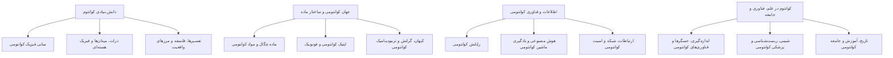

# درخت دسته‌بندی محتوای Qpedia

این سند ساختار مصوب کاری برای ممیزی ۳۱۰ مقاله است:

- ۴ دستهٔ مادر
- ۱۲ دستهٔ اصلی؛ زیر هر مادر ۳ دسته
- ۶۰ زیردسته؛ زیر هر دستهٔ اصلی ۵ زیردسته
- مجموع اصطلاحات دسته‌بندی: ۷۶ مورد، شامل ۴ مادر، ۱۲ دستهٔ اصلی و ۶۰ زیردسته

> هر مقاله فقط یک مسیر اصلی از «مادر ← دستهٔ اصلی ← زیردسته» می‌گیرد. موضوعات جانبی با برچسب مدیریت می‌شوند، نه با چند دستهٔ اصلی.

## نمایش گرافیکی فشرده



## درخت کامل

```text
دانش بنیادی کوانتوم — quantum-foundations
├── مبانی فیزیک کوانتومی — quantum-fundamentals
│   ├── مفاهیم و کمیت‌های پایه — basic-quantum-concepts
│   ├── حالت کوانتومی و تابع موج — quantum-states-wave-function
│   ├── اندازه‌گیری، احتمال و عدم‌قطعیت — measurement-probability-uncertainty
│   ├── برهم‌نهی، درهم‌تنیدگی و همدوسی — superposition-entanglement-coherence
│   └── اثرها و پدیده‌های کوانتومی — quantum-effects-phenomena
│
├── ذرات، میدان‌ها و فیزیک هسته‌ای — particles-fields-nuclear
│   ├── ذرات بنیادی و مدل استاندارد — elementary-particles-standard-model
│   ├── کوارک‌ها، هادرون‌ها و نیروی قوی — quarks-hadrons-strong-force
│   ├── میدان‌های کوانتومی و نیروهای بنیادی — quantum-fields-fundamental-forces
│   ├── هسته، واپاشی و واکنش‌های هسته‌ای — nuclear-physics-decay
│   └── پادماده، ماده تاریک و ذرات فرضی — antimatter-dark-matter-hypothetical-particles
│
└── تفسیرها، فلسفه و مرزهای واقعیت — quantum-interpretations-philosophy
    ├── تفسیرهای مکانیک کوانتومی — quantum-interpretations
    ├── پارادوکس‌ها و آزمایش‌های فکری — quantum-paradoxes-thought-experiments
    ├── واقعیت، علیت و مسئله ناظر — reality-causality-observer
    ├── زمان، اختیار و آگاهی — time-free-will-consciousness
    └── چندجهانی و فرضیه‌های واقعیت — multiverse-reality-hypotheses

جهان کوانتومی و ساختار ماده — quantum-world-matter
├── ماده چگال و مواد کوانتومی — condensed-matter-quantum-materials
│   ├── ابررسانایی و پیوند جوزفسون — superconductivity-josephson
│   ├── ابرشارگی، چگالش و گازهای کوانتومی — superfluidity-condensates-quantum-gases
│   ├── مواد و فازهای توپولوژیک — topological-quantum-materials
│   ├── مغناطیس و سامانه‌های اسپینی — quantum-magnetism-spin-systems
│   └── شبه‌ذرات و برانگیختگی‌های جمعی — quasiparticles-collective-excitations
│
├── اپتیک کوانتومی و فوتونیک — quantum-optics-photonics
│   ├── نور، فوتون و برهم‌کنش نور و ماده — light-photons-light-matter
│   ├── لیزرها و اپتیک غیرخطی — lasers-nonlinear-optics
│   ├── منابع و حالت‌های نور کوانتومی — quantum-light-sources-states
│   ├── آشکارسازی و اندازه‌گیری نور — photon-detection-optical-measurement
│   └── تصویربرداری، میکروسکوپی و لیتوگرافی — quantum-imaging-microscopy-lithography
│
└── کیهان، گرانش و ترمودینامیک کوانتومی — quantum-cosmology-gravity-thermodynamics
    ├── گرانش کوانتومی و فضا–زمان — quantum-gravity-spacetime
    ├── سیاه‌چاله‌ها، افق و اطلاعات — black-holes-horizons-information
    ├── کیهان‌شناسی و جهان آغازین — quantum-cosmology-early-universe
    ├── ترمودینامیک، آنتروپی و ماشین‌های کوانتومی — quantum-thermodynamics-entropy-machines
    └── سامانه‌های چندجسمی و گرمایی‌شدن — quantum-many-body-thermalization

اطلاعات و فناوری کوانتومی — quantum-information-technology
├── رایانش کوانتومی — quantum-computing
│   ├── کیوبیت، گیت و مدار کوانتومی — qubits-gates-circuits
│   ├── الگوریتم‌های کوانتومی — quantum-algorithms
│   ├── سخت‌افزار و معماری رایانه کوانتومی — quantum-computing-hardware
│   ├── تصحیح خطا، کنترل و محدودیت‌ها — quantum-error-control-limitations
│   └── نرم‌افزار، برنامه‌نویسی و شبیه‌سازی — quantum-software-programming-simulation
│
├── هوش مصنوعی و یادگیری ماشین کوانتومی — quantum-ai-machine-learning
│   ├── مبانی یادگیری ماشین کوانتومی — quantum-machine-learning-foundations
│   ├── هسته‌ها و نگاشت ویژگی کوانتومی — quantum-kernels-feature-maps
│   ├── شبکه‌های عصبی و مدل‌های مولد کوانتومی — quantum-neural-generative-models
│   ├── یادگیری تقویتی و بهینه‌سازی هوشمند — quantum-reinforcement-intelligent-optimization
│   └── کاربردها، محدودیت‌ها و ادعاهای هوش مصنوعی — quantum-ai-applications-limitations-claims
│
└── ارتباطات، شبکه و امنیت کوانتومی — quantum-communication-security
    ├── ارتباط و تله‌پورت کوانتومی — quantum-communication-teleportation
    ├── رمزنگاری و توزیع کلید کوانتومی — quantum-cryptography-qkd
    ├── شبکه، ریپیتر و اینترنت کوانتومی — quantum-networks-repeaters-internet
    ├── امنیت و رمزنگاری پساکوانتومی — post-quantum-security
    └── پروتکل‌های اعتماد و کاربردهای رمزنگاری — quantum-trust-cryptographic-protocols

کوانتوم در علم، فناوری و جامعه — quantum-science-technology-society
├── اندازه‌گیری، حسگرها و فناوری‌های کوانتومی — quantum-sensing-technologies
│   ├── سنجش و مترولوژی کوانتومی — quantum-sensing-metrology
│   ├── زمان‌سنجی، ساعت اتمی و ناوبری — atomic-clocks-navigation
│   ├── رادار، لیدار و سنجش نوری — quantum-radar-lidar-optical-sensing
│   ├── الکترونیک و فناوری‌های روزمره — quantum-electronics-everyday-technology
│   └── تجهیزات و زیرساخت آزمایشگاهی — quantum-laboratory-infrastructure
│
├── شیمی، زیست‌شناسی و پزشکی کوانتومی — quantum-chemistry-biology-medicine
│   ├── شیمی کوانتومی و ساختار مولکولی — quantum-chemistry-molecular-structure
│   ├── زیست‌شناسی کوانتومی — quantum-biology
│   ├── مغز، آگاهی و علوم اعصاب — quantum-brain-neuroscience
│   ├── پزشکی، تصویربرداری و تشخیص — quantum-medicine-imaging-diagnostics
│   └── ادعاهای درمانی و شبه‌علم پزشکی — quantum-medical-pseudoscience
│
└── تاریخ، آموزش و جامعه کوانتومی — quantum-history-education-society
    ├── آزمایش‌ها و رویدادهای تاریخی — quantum-historical-experiments-events
    ├── دانشمندان، زندگی‌نامه‌ها و جایزه‌ها — quantum-scientists-biographies-awards
    ├── آموزش، منابع و مسیر یادگیری — quantum-learning-resources
    ├── سواد علمی و تشخیص شبه‌علم — scientific-literacy-pseudoscience
    └── فرهنگ، رسانه، صنعت و آینده کوانتوم — quantum-culture-media-industry-future
```

## قاعده ممیزی مقاله‌ها

در مرحلهٔ جای‌گذاری ۳۱۰ مقاله، برای هر عنوان یکی از این چهار حکم ثبت می‌شود:

1. **حفظ**: عنوان درست و دارای ظرفیت یک مقاله مستقل است.
2. **اصلاح عنوان**: موضوع معتبر است، اما عنوان از نظر علمی، زبانی یا دامنه نیاز به اصلاح دارد.
3. **ادغام**: با مقاله‌ای دیگر هم‌موضوع یا تکراری است؛ مقاله مرجع و دلیل ادغام باید مشخص شود.
4. **حذف از فهرست انتشار**: موضوع واقعاً نامرتبط با قلمرو Qpedia است یا ظرفیت مقاله مستقل علمی ندارد؛ حذف فقط با دلیل مکتوب انجام می‌شود.

هیچ عنوانی صرفاً به‌علت عامه‌پسندبودن، میان‌رشته‌ای‌بودن یا نقد شبه‌علم حذف نمی‌شود؛ معیار، وجود پیوند علمی روشن با فیزیک کوانتومی و امکان نگارش مستند است.
