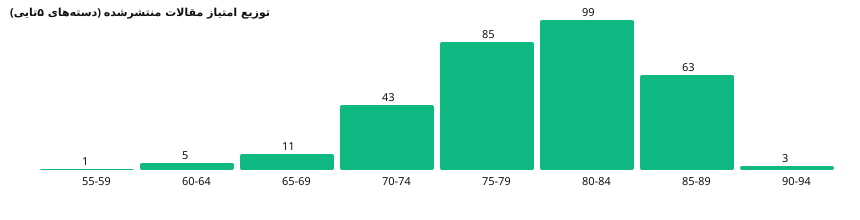
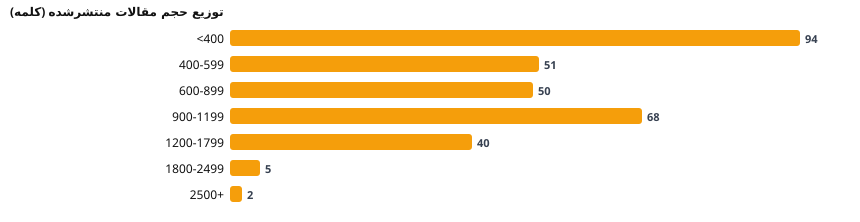
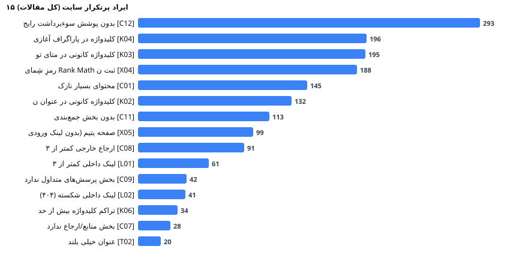

# تصویر کلی سلامت سئو و ساختار qpedia.ir — WordPress.2026-09-21qpedia.xml

## ۱) منابع داده (خام، بدون حدس)
| منبع | نقش در تحلیل |
|---|---|
| `WordPress.2026-09-21qpedia.xml` | منبع اصلی: 310 مقالهٔ `quantum_article` + پیوست‌ها (آخرین وضعیت «تا امروز») |
| `WordPress.2026-09-21qpedia.xml` | 56 صفحهٔ دانشمند (برای اعتبارسنجی لینک داخلی) |
| `WordPress.2026-09-14 all.xml` | نسخهٔ ۱۴ سپتامبر: شناسایی مقالات حذف‌شده/تغییرنام‌یافته |
| `quantum-pedia-child (13).zip` | قالب فرزند: رفتار H1، شِما، TOC، فهرست مطالب |

## ۲) شمارش‌های پایه (واقعی، از داخل فایل‌ها)
| متریک | مقدار |
|---|---|
| کل مقالات (CPT) | 310 |
| منتشرشده | 310 |
| پیش‌نویس | 0 |
| سطل‌زباله | 0 |
| صفحات دانشمند (منتشرشده) | 56 |
| پیوست‌های رسانه (یکتا در خروجی) | 649 |
| پیوست با ALT ثبت‌شده در سطح کتابخانه | ۳۴۱ عدد (پوشش ۱۰۰٪ ALT کتابخانه — طبق خروجی امروز) |
| مجموع کلمات همهٔ مقالات | 245,188 |
| مجموع کلمات منتشرشده‌ها | 245,188 |
| میانگین/میانهٔ کلمات منتشرشده | 791 / 735.0 |
| میانگین زمان مطالعه (منتشرشده) | 4.0 دقیقه |
| تصاویر داخل بدنهٔ مقالات | 36 (همه با ALT — ۰ مورد فاقد/خالی) |
| لینک داخلی (کل، با درج‌های متعدد) | 1365 |
| لینک خارجی (کل) | 922 |
| دامنه‌های خارجی یکتا | 37 |

## ۳) رتبه‌بندی مقالات منتشرشده
- 🔴 قرمز: **2** · 🟡 زرد: **254** · 🟢 سبز: **54**
- امتیاز: میانگین **79.3** · میانه **80.0** · بازه **59 تا 91**

## ۴) پرتکرارترین ایرادها (کل مقالات)
| کد | شرح | تعداد | شدت |
|---|---|---|---|
| C12 | بدون پوشش سوءبرداشت رایج | 293 | کم |
| K04 | کلیدواژه در پاراگراف آغازین نیست | 196 | متوسط |
| K03 | کلیدواژه کانونی در متای توضیح نیست | 195 | کم |
| X04 | رمزِ شِمای Rank Math ثبت نشده | 188 | کم |
| C01 | محتوای بسیار نازک | 145 | بالا |
| K02 | کلیدواژه کانونی در عنوان نیست | 132 | متوسط |
| C11 | بدون بخش جمع‌بندی | 113 | کم |
| X05 | صفحه یتیم (بدون لینک ورودی داخلی) | 99 | متوسط |
| C08 | ارجاع خارجی کمتر از ۳ | 91 | متوسط |
| L01 | لینک داخلی کمتر از ۳ | 61 | متوسط |
| C09 | بخش پرسش‌های متداول ندارد | 42 | کم |
| L02 | لینک داخلی شکسته (۴۰۴) | 41 | بالا |
| K06 | تراکم کلیدواژه بیش از حد | 34 | متوسط |
| C07 | بخش منابع/ارجاع ندارد | 28 | متوسط |
| T02 | عنوان خیلی بلند | 20 | متوسط |

## ۵) لینک‌شناسی
| متریک | مقدار |
|---|---|
| لینک داخلی شکسته (۴۰۴) | 41 |
| لینک به پیش‌نویس/زباله‌دان | 0 |
| مقالهٔ منتشرشدهٔ یتیم (۰ لینک ورودی) | 99 |
| مقالهٔ منتشرشده با <۳ لینک داخلی | 61 |
| انکرتکست کلی «اینجا/کلیک کنید» | 0 بُروز در مقالات |
| بیشترین دامنه‌های ارجاع‌شده | doi.org (207)، britannica.com (34)، nobelprize.org (22)، plato.stanford.edu (12)، arxiv.org (8)، feynmanlectures.caltech.edu (6)، nature.com (6)، quantiki.org (3) |

## ۶) یافته‌های ساختاری مهم
1. **دوپلیکیت موضوعی «زندهٔ» امروز: صفر مورد** ✔ (الگوی `name-2` که در نسخهٔ ۱۴ سپتامبر وجود داشت، در نسخهٔ ۲۰ سپتامبر پاک شده است) — اما به‌جای آن، **۳۱ نشانی قدیمی حذف‌شده رها شده** که اگر ایندکس/لینک شده باشند ۴۰۴ می‌دهند → نیازمند ریدایرکت ۳۰۱ یا پاسخ ۴۱۰ (فهرست کامل: فاز ۱‑۴ فایل ۰۶ و نقشهٔ آماده در `redirects/`).
2. **31 نشانی قدیمی حذف‌شده نسبت به ۱۴ سپتامبر** → نیازمند ریدایرکت ۳۰۱ (فهرست: فاز ۱‑۴).
3. **1 مقالهٔ منتشرشده بدون Focus Keyword** و **1 بدون توضیح متا**.
4. **اسلاگ‌های اشتباه/غیریکتا در بخش دانشمندان:** `albert-einstein-2` (مقالات به `…/scientists/albert-einstein/` لینک می‌دهند → ۴۰۴ واقعی) · `max-plank` (غلطِ املای Planck؛ درحالی‌که مقالات به `…/scientists/max-planck/` لینک می‌دهند) · `schrodingerr` (تایپو) در کنار `erwin-schrodinger`. اقدام: تصحیح اسلاگ + ریدایرکت ۳۰۱ از نشانی غلط.
5. تصویر شاخص: 9 مقالهٔ منتشرشده بدون تصویر، 0 مقاله با شاخصِ فاقد ALT.
6. دسترسی/کیفیت فارسی: 0 مقاله حروف عربی «ي/ك» در متن دارند.
7. ZIPهای تصاویر سایت (`features_Q-7.zip` و …) نام‌های فایل عددی (`10000xxxxx.jpg`) و غیرتوصیفی دارند → عامل I05 در صورت آپلود.

## ۷) توزیع محتوا
- پیش‌نویس: 0 مقاله (خط لولهٔ انتشار — شامل سری «لیست جدید»).
- ماه‌های انتشار (از wp:post_date): 2026-08: 17، 2026-09: 293
- دسته‌ها (منتشرشده): فناوری و کاربردهای کوانتومی (66)، رایانش و ارتباطات کوانتومی (57)، مبانی و مفاهیم کوانتوم (43)، پدیده‌های کوانتومی (35)، تاریخ و آزمایش‌های کوانتوم (26)، مفاهیم پایه (25)، تاریخ کوانتوم (22)، نقد شبه‌علم (18)، تفسیرها و فلسفهٔ کوانتوم (16)، فناوری‌های روزمره (13)، ذرات بنیادی (13)، آزمایش‌های کوانتومی (10)

## ۸) چکیدهٔ قضاوت
- زیرساخت فنی قالب قوی است: یک H1 تمیز، شِمای Article خودکار، TOC خودکار، فونت محلی، ALT ۱۰۰٪ در کتابخانه.
- مشکل اصلی **سیستماتیک** است نه پراکنده: Focus Keyword و متا در بخش بزرگی از بایگانی ثبت نشده؛ گراف لینک داخلی ضعیف با ۷۸ لینک شکسته + ۷۴ لینک به پیش‌نویس + 99 یتیم؛ و ۲۵+ جفت دوپلیکیت موضوعی.
- نقاط قوت محتوایی: ارجاع به DOI/منبع معتبر فراوان (207 مقاله به doi.org)، محتوای یکتا (۰ خوشهٔ کپی ۱۰۰٪)، ساختار تیتر خوب در اکثریت.
